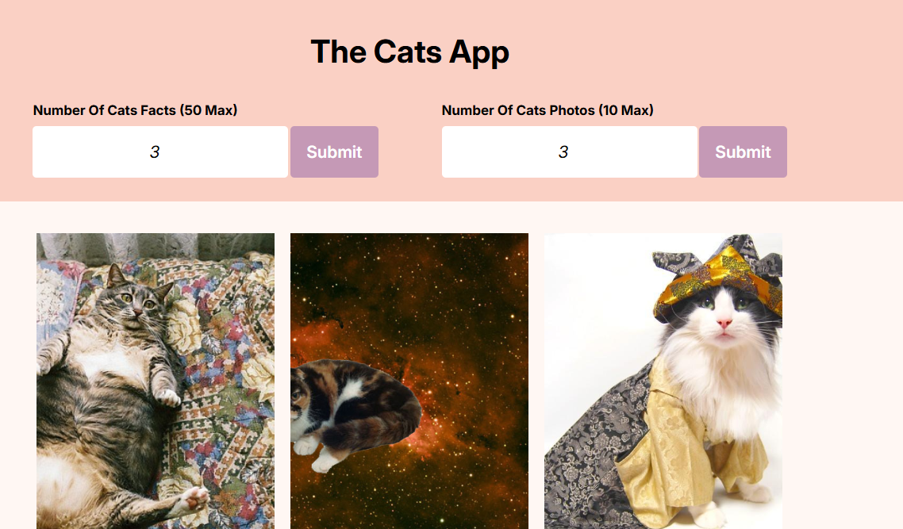

# The Pussy App 🐱

A delightful web application that fetches random cat facts and adorable cat photos to brighten your day! Built with vanilla JavaScript and modern web APIs.

## Features

- 📚 **Cat Facts**: Get up to 50 random interesting facts about cats
- 📸 **Cat Photos**: Fetch up to 10 random cat photos
- ⚡ **Loading Animations**: Smooth spinner animations while fetching data
- 🎯 **Error Handling**: Graceful error messages and user feedback
- 📱 **Responsive Design**: Works on desktop and mobile devices

## Preview


## Demo
**Live URL**: [Vercel URL link]() 

The app provides two main functionalities:

1. **Cat Facts Generator**: Enter a number (1-50) to get random cat facts
2. **Cat Photo Gallery**: Enter a number (1-10) to get random cat photos

## Technologies Used

- **Frontend**: HTML5, CSS3, Vanilla JavaScript
- **HTTP Client**: Axios for API requests
- **Build Tool**: Vite
- **APIs**:
  - [MeowFacts API](https://meowfacts.herokuapp.com/) - For cat facts
  - [TheCatAPI](https://thecatapi.com/) - For cat photos

## Installation & Setup

1. **Clone the repository**
   ```bash
   git clone <repository-url>
   cd the-pussy-app
   ```

2. **Install dependencies**
   ```bash
   npm install
   ```

3. **Start development server**
   ```bash
   npm run dev
   ```

4. **Build for production**
   ```bash
   npm run build
   ```

## API Endpoints

### Cat Facts API
- **URL**: `https://meowfacts.herokuapp.com/`
- **Parameters**: `count` (1-50)
- **Response**: Array of cat fact strings

### Cat Photos API
- **URL**: `https://api.thecatapi.com/v1/images/search`
- **Parameters**: `limit` (1-10)
- **Response**: Array of cat image objects with URLs and dimensions

## Acknowledgments

- [MeowFacts API](https://meowfacts.herokuapp.com/) for providing cat facts
- [TheCatAPI](https://thecatapi.com/) for cat photos
- All the cat lovers who inspired this project! 🐱

---

**Made with ❤️ and lots of cat love!**